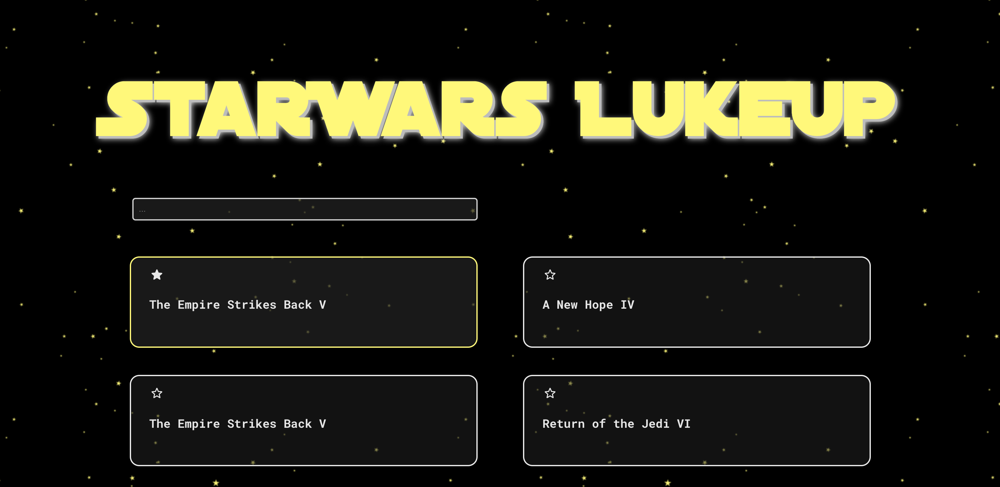

# SWAPI lukeup

A simple coding challenge using the Star Wars API:
- navigation through the characters endpoints
- persistent storage of favourite films using local storage and page context
- predictive search bar
- page router with react-router-dom
- tooltips built with Material UI to discover further deatils about each character
- flex and grid layouts with CSS styling

